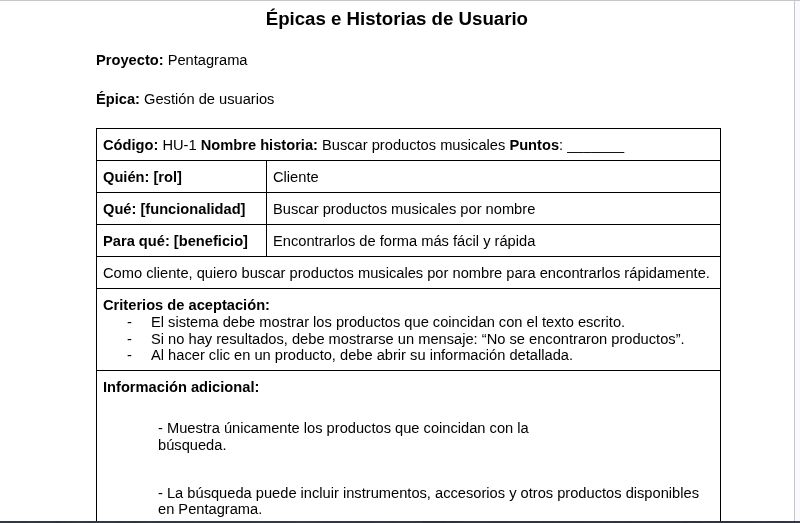

# 🎵 PENTAGRAMA

## ¿De qué trata mi sitio web?

**Pentagrama** es un sitio web pensado para una empresa relacionada con la música. Su objetivo es ofrecer en un solo lugar productos y servicios relacionados con este campo.

En el sitio se podrán consultar y comprar instrumentos musicales y accesorios, conocer sus características, precios y disponibilidad. También se podrán consultar diferentes clases de música, conocer la información de cada servicio y realizar solicitudes.

Además, el sitio tendrá interacción con los clientes o usuarios. Los usuarios podrán registrarse, iniciar sesión, consultar productos, realizar pedidos, revisar el estado de sus compras, solicitar clases y enviar mensajes a la empresa.

Para organizar toda esta información se diseñó una base de datos que permite almacenar los usuarios, productos, categorías, pedidos, servicios, solicitudes de clases y mensajes.

---

# Documento del proyecto

Para consultar el documento completo del proyecto:

**[🔗 Ver documento en Google Docs]([ Ver documento en Google Docs](https://docs.google.com/document/d/1HoUUTZ2C-VmbpfyP1hvWD2HgfFJKvaBXqHa-idTcNmc/edit?usp=sharing))**

---

# 1. Planteamiento del problema

## Causas

* No siempre existe un sitio web que reúna productos y servicios musicales en un mismo lugar.
* A los clientes se les puede dificultar conocer los precios, características y disponibilidad de los instrumentos.
* Algunas empresas pequeñas tienen poca presencia en internet.
* Los pedidos o solicitudes de clases pueden realizarse únicamente de manera presencial.
* La información de los clientes puede ser difícil de organizar cuando no se cuenta con una base de datos.

## Consecuencias

* Los clientes tienen que desplazarse hasta el negocio para consultar información.
* Se pueden perder oportunidades de conseguir nuevos clientes por no tener presencia digital.
* Puede ser más complicado comparar diferentes productos.
* Se pueden perder solicitudes de compra o de clases.
* El crecimiento y alcance de la empresa puede ser más lento.

## Problema

Las personas interesadas en comprar instrumentos musicales, accesorios o aprender música pueden tener dificultades para encontrar información organizada sobre productos, precios, disponibilidad y clases en un solo lugar. Además, una empresa que maneja estos servicios principalmente de forma presencial puede tener menos alcance y dificultades para organizar la información de sus clientes.

## Aporte

**Pentagrama** busca solucionar esta situación mediante un sitio web donde los clientes puedan consultar productos musicales, categorías, precios y servicios de clases. También podrán realizar pedidos, solicitar clases y enviar mensajes a la empresa.

La base de datos permitirá almacenar y organizar la información de los usuarios, productos, categorías, pedidos, servicios, solicitudes y mensajes, facilitando la administración del sitio.

### Evidencias del planteamiento del problema

---

# 2. Épicas e Historias de Usuario

Las épicas e historias de usuario permiten identificar las principales funciones que tendrá el sitio web y las acciones que podrán realizar los diferentes usuarios de Pentagrama.

### Evidencias de las Épicas e Historias de Usuario

---

# 3. Diagrama Modelo Entidad - Relación de la BD

El modelo Entidad-Relación representa las entidades que forman parte del sistema y las relaciones que existen entre ellas.

Para Pentagrama se tuvieron en cuenta las entidades relacionadas con los usuarios, productos, categorías, pedidos, servicios, solicitudes y mensajes.

El diagrama fue realizado en **diagrams.net**, teniendo en cuenta la interacción que tendrán los clientes o usuarios con el sitio web.

### Evidencia del Modelo Entidad-Relación

---

# 4. Diagrama Modelo Relacional de la BD

El modelo relacional representa la base de datos mediante tablas, mostrando sus claves primarias y claves foráneas.

En este modelo se organizaron las entidades del sistema como tablas y se establecieron las relaciones necesarias para conectar correctamente la información.

El diagrama fue realizado en **diagrams.net**.

### Evidencia del Modelo Relacional

---

# 5. Diagrama Modelo Físico de la BD

El modelo físico corresponde a la implementación de la base de datos en **phpMyAdmin** utilizando MySQL.

En esta parte se crearon las tablas de la base de datos **Pentagrama**, junto con sus campos, claves primarias y claves foráneas.

Las tablas utilizadas son:

* USUARIO
* PEDIDO
* DETALLE_PEDIDO
* PRODUCTO
* CATEGORIA
* SERVICIO
* SOLICITUD_SERVICIO
* MENSAJE

### Evidencia del Modelo Físico

